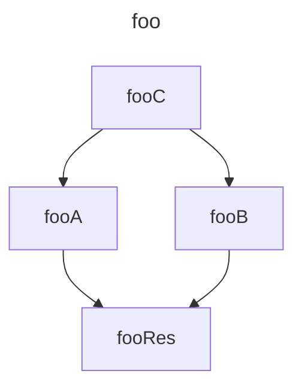
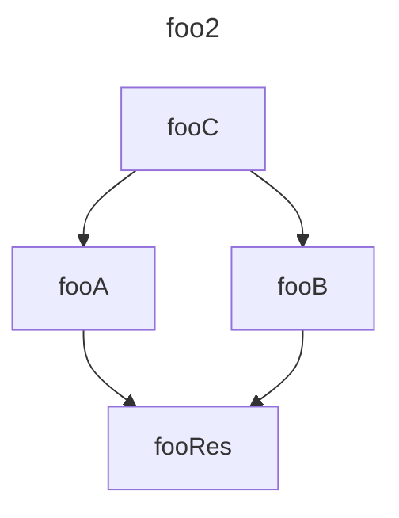
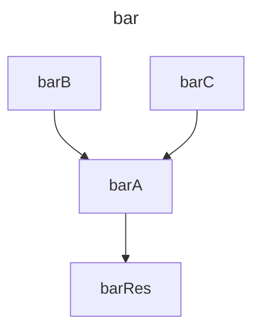

```mermaid
---
title: foo
---
graph TD
	fooA --> fooRes
	fooB --> fooRes
	fooC --> fooA
	fooC --> fooB
```

```mermaid
---
title: foo2
---
graph TD
	fooA --> fooRes
	fooB --> fooRes
	fooC --> fooA
	fooC --> fooB
```

```mermaid
---
title: bar
---
graph TD
	barA --> barRes
	barB --> barA
	barC --> barA
```