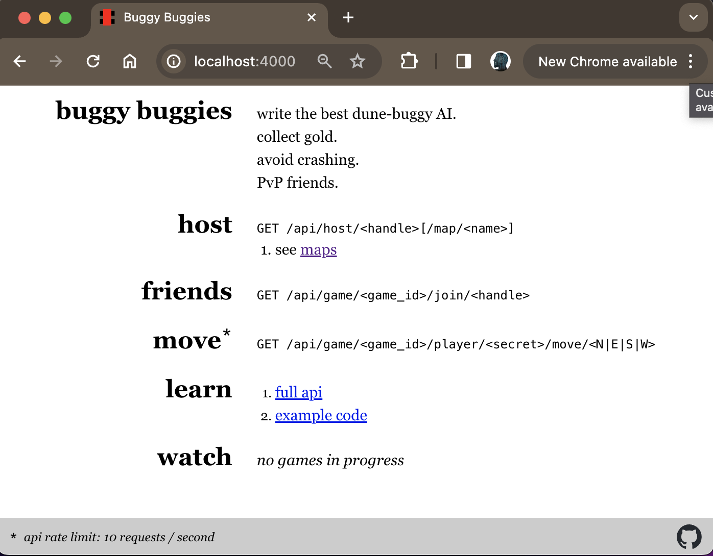
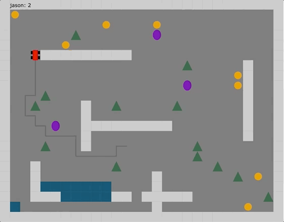

# HTTP Services

As Claro provides simple HTTP support out of the box, you can export HTTP Service definitions from Module APIs. For
example, the following Buggy Buggies game[^1] can be controlled by sending HTTP GET requests to the endpoints defined
below:



So, we can encode this api as an HTTP Service that can be called programmatically by Claro programs by exporting the
following from a Module API:

{{EX1}}

In this case the static HTTP client being exported by this Module will allow messages to be sent to the local port that
the Buggy Buggies game is running on:

{{EX2}}

Now, a dependent can easily make calls to the various HTTP endpoints exposed by the service and from the dependent's
perspective it appears just like any other procedure call returning a `future<...>`.

#### _Fig 3:_
---
```claro
var hostGameRes: oneof<string, std::Error<string>>
  <-| BuggyBuggies::hostGame(BuggyBuggies::BUGGY_BUGGIES_CLIENT, "jason");

print("Host Game Response:\n{hostGameRes}");
```
_Output:_
```
Host Game JSON Response:
{"reason":null,"success":true,"result":{"watch":"http://localhost:4000/game/04cfad01","secret":"7f3b8ae5","game_id":"04cfad01","example":"curl -X GET http://localhost:4000/api/game/04cfad01/player/7f3b8ae5/move/N"}}
```
---

Now, you can imagine how a more complex Claro program could use the HTTP client to this service to make a bot that
automatically plays the game collecting as much gold as possible.



Check out the 
<a href="https://github.com/JasonSteving99/claro-lang/tree/033326c49ee5e53066e47ad8ea0e922ebd41956a/examples/claro_programs/demo_server/buggy_buggies" target="_blank">full-fledged implementation</a>
of the Claro program controlling the buggy in the above gif.

---

[^1]: Buggy Buggies was built by [Jake Wood](https://github.com/jzwood/buggy-buggies), thank you for sharing this!